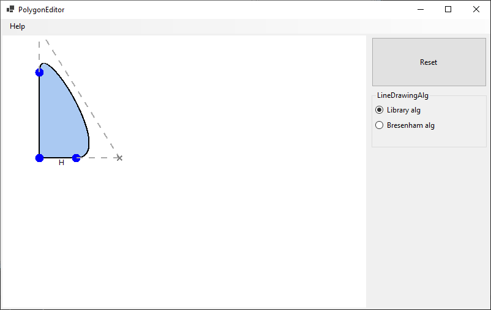
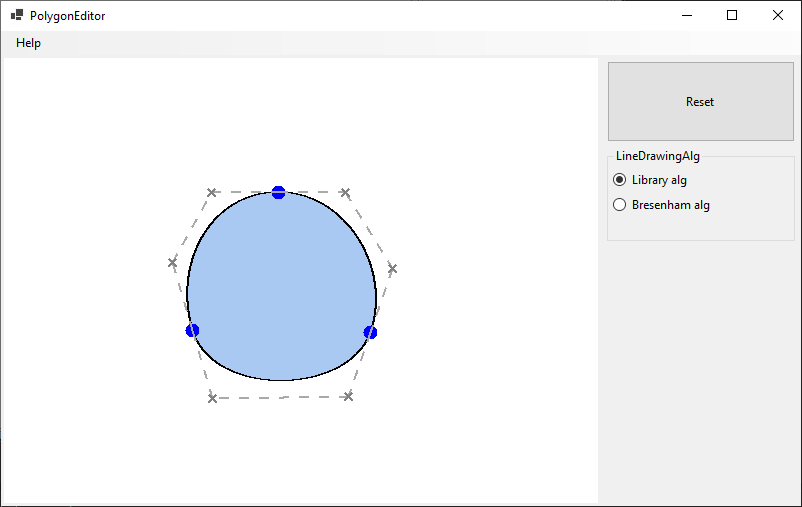
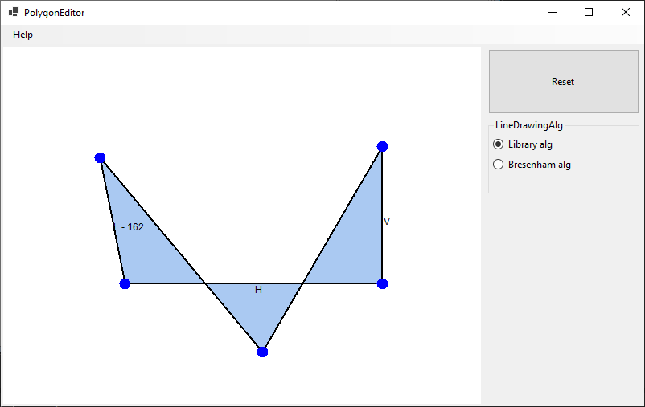

# Polygon Editor

Polygon Editor is an interactive application designed for creating and modifying polygons with 
advanced geometric constraints and Bézier curve support.
It provides an intuitive interface for users to manipulate shapes by adding vertices,
transforming edges, and enforcing relationships between them.

<p align="center">
  
</p>

## Features

### Vertex Manipulation
- Users can add, remove, and reposition vertices to modify the shape dynamically.
- The entire polygon can be moved while maintaining defined constraints.

### Edge Constraints
Polygon edges can be assigned specific constraints to maintain geometric relationships:
- Horizontal Constraint - Ensures that an edge always remains perfectly horizontal.
- Vertical Constraint - Ensures that an edge always remains perfectly vertical.
- Fixed Distance Constraint - Maintains a constant distance between two connected vertices.

### Bézier Curves Support
Any straight polygon edge can be converted into a third-degree Bézier curve for smooth, complex shapes.
Bézier curve control points can be manipulated to achieve the desired curvature.

#### Bézier Curve Continuity
For enhanced curve smoothness, users can enforce different types of continuity at vertices:

- G0 (Positional Continuity) - Ensures that connected curves meet at the same point.
- G1 (Tangency Continuity) - Maintains a continuous direction between two adjacent curves.
- C1 (Differentiable Continuity) - Ensures that adjacent curves share the same first derivative.

### Edge Rendering
Users can select different algorithms for drawing polygon edges:

- Library Algorithm - Uses the built-in ```System.Drawing``` functions.
- Bresenham’s Algorithm - A custom implementation of the Bresenham line algorithm.

<p align="center">
  
</p>

<p align="center">
  
</p>
